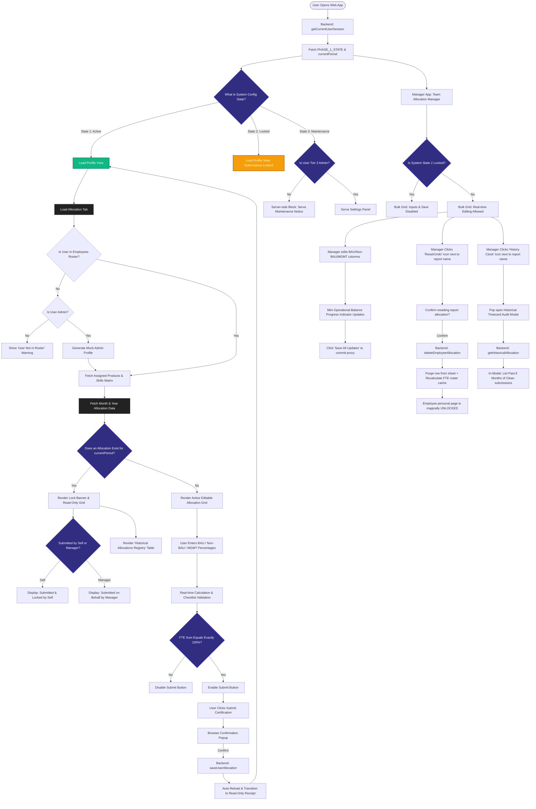

# Employee Allocation Lifecycle Flow

```mermaid
graph TD
    %% Define Styles
    classDef stateActive fill:#10b981,stroke:#047857,stroke-width:2px,color:#fff;
    classDef stateLocked fill:#f59e0b,stroke:#b45309,stroke-width:2px,color:#fff;
    classDef stateMaint fill:#ef4444,stroke:#b91c1c,stroke-width:2px,color:#fff;
    classDef process fill:#222,stroke:#444,stroke-width:1px,color:#fff;
    classDef decision fill:#312e81,stroke:#4338ca,stroke-width:2px,color:#fff;

    %% --- START: IDENTITY & SYSTEM CONFIG ---
    Start([User Opens Web App]) --> GetSession[Backend: getCurrentUserSession]
    GetSession --> GetConfig[Fetch PHASE_1_STATE & currentPeriod]
    
    %% --- STATE EVALUATIONS ---
    GetConfig --> EvaluateState{What is System Config State?}
    
    EvaluateState -->|State 1: Active| LoadProfile[Load Profile View]:::stateActive
    EvaluateState -->|State 2: Locked| LoadLockedProfile[Load Profile View: Submissions Locked]:::stateLocked
    EvaluateState -->|State 3: Maintenance| EvaluateRole{Is User Tier 3 Admin?}:::stateMaint
    
    %% --- STATE 3: MAINTENANCE BYPASS CHECK ---
    EvaluateRole -->|No| ServeMaintPage[Server-side Block: Serve Maintenance Notice]
    EvaluateRole -->|Yes| ServeAdminSettings[Serve Settings Panel]
    
    %% --- EMPLOYEE PROCESS (STATE 1 & 2) ---
    LoadProfile --> LoadAllocation[Load Allocation Tab]:::process
    LoadAllocation --> QueryRoster{Is User in Employees Roster?}
    
    QueryRoster -->|No| EvaluateAdmin{Is User Admin?}
    EvaluateAdmin -->|No| ShowRosterError[Show 'User Not in Roster' Warning]
    EvaluateAdmin -->|Yes| GenMockAdmin[Generate Mock Admin Profile]
    GenMockAdmin --> FetchMatrix[Fetch Assigned Products & Skills Matrix]
    
    QueryRoster -->|Yes| FetchMatrix
    FetchMatrix --> FetchHistorical[Fetch Month & Year Allocation Data]:::process
    
    FetchHistorical --> CheckSubmission{Does an Allocation Exist for currentPeriod?}:::decision
    
    CheckSubmission -->|Yes| RenderReadOnly[Render Lock Banner & Read-Only Grid]
    RenderReadOnly --> CheckAuthor{Submitted by Self or Manager?}
    CheckAuthor -->|Self| DisplaySelfLocked[Display: Submitted & Locked by Self]
    CheckAuthor -->|Manager| DisplayProxyLocked[Display: Submitted on Behalf by Manager]
    RenderReadOnly --> RenderPastTimeline[Render 'Historical Allocations Registry' Table]
    
    CheckSubmission -->|No| RenderEditableGrid[Render Active Editable Allocation Grid]
    RenderEditableGrid --> UserInput[User Enters BAU / Non-BAU / MGMT Percentages]
    UserInput --> DynamicCalc[Real-time Calculation & Checklist Validation]
    DynamicCalc --> CheckCapacity{FTE Sum Equals Exactly 100%?}:::decision
    
    CheckCapacity -->|No| BlockSubmit[Disable Submit Button]
    CheckCapacity -->|Yes| EnableSubmit[Enable Submit Button]
    
    EnableSubmit --> ClickSubmit[User Clicks Submit Certification]
    ClickSubmit --> ConfirmDlg[Browser Confirmation Popup]
    ConfirmDlg -->|Confirm| SaveAlloc[Backend: saveUserAllocation]
    SaveAlloc --> ReloadPage[Auto-Reload & Transition to Read-Only Receipt]
    ReloadPage --> LoadProfile
    
    %% --- MANAGER PROCESS (STATE 1 & 2) ---
    GetConfig --> LoadManagerGrid[Manager App: Team Allocation Manager]
    LoadManagerGrid --> CheckStateLocked{Is System State 2 Locked?}
    
    CheckStateLocked -->|Yes| RenderGridLocked[Bulk Grid: Inputs & Save Disabled]
    CheckStateLocked -->|No| RenderGridEditable[Bulk Grid: Real-time Editing Allowed]
    
    RenderGridEditable --> MgrEdit[Manager edits BAU/Non-BAU/MGMT columns]
    MgrEdit --> RealTimeProgress[Mini Operational Balance Progress Indicator Updates]
    RealTimeProgress --> SaveTeam[Click 'Save All Updates' to commit proxy]
    
    RenderGridEditable --> ClickReset[Manager Clicks 'Reset/Undo' Icon next to report name]
    ClickReset --> ConfirmReset[Confirm resetting report allocation?]
    ConfirmReset -->|Confirm| DeleteAlloc[Backend: deleteEmployeeAllocation]
    DeleteAlloc --> PurgeAllocRow[Purge row from sheet + Recalculate FTE roster cache]
    PurgeAllocRow --> EmployeeUnlocked[Employee personal page is magically UNLOCKED]
    
    %% --- MANAGER HISTORY MODAL ---
    RenderGridEditable --> ClickHistory[Manager Clicks 'History Clock' Icon next to report name]
    ClickHistory --> OpenModal[Pop open Historical Timecard Audit Modal]
    OpenModal --> FetchPastRecords[Backend: getHistoricalAllocation]
    FetchPastRecords --> RenderAuditTable[In-Modal: List Past 6 Months of Clean submissions]
    
    %% Apply classes
    class EvaluateState,EvaluateRole,CheckSubmission,CheckCapacity,CheckStateLocked,CheckAuthor decision;
```
